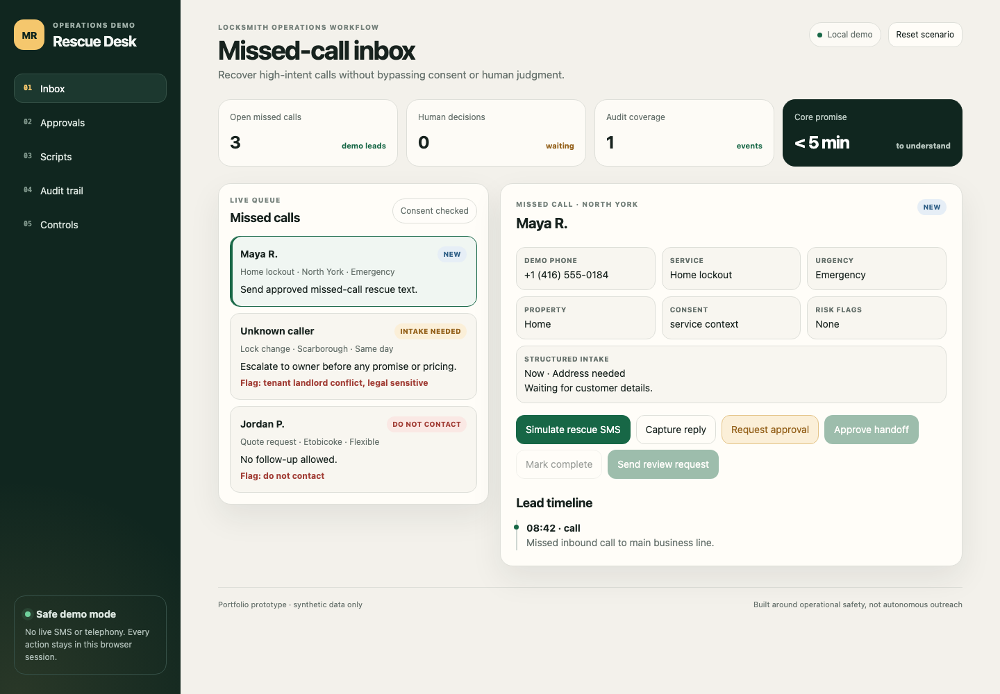

# Missed-Call Rescue Desk

A safety-gated lead recovery demo for locksmith and home-service operations.
It turns a missed call into structured intake, a human-reviewed dispatch
handoff, and an auditable follow-up flow—without contacting a real customer.



## Why this exists

Urgent service customers often call the next provider within minutes. A useful
recovery workflow needs to respond quickly, but it also needs consent checks,
clear escalation rules, and an operator who remains accountable for sensitive
decisions. This prototype demonstrates that balance.

## What the demo proves

- A missed call can move through rescue, intake, dispatch, completion, and a
  voluntary review request.
- Legal-sensitive scenarios stop in a human approval queue.
- A previous opt-out disables messages, reply capture, and approval bypasses.
- Meaningful actions create a session audit event with actor, lead, channel,
  and result.
- Desktop and mobile workflows are covered by automated browser tests.

All names, phone numbers, locations, and events are synthetic fixtures. The
application has no SMS, phone, CRM, authentication, or production database
integration.

## Run locally

Requirements: Node.js 20 or newer.

```bash
npm ci
npm start
```

Open `http://127.0.0.1:8879/`.

## Verify the project

Install Playwright's Chromium build once, then run the complete gate:

```bash
npx playwright install chromium
npm run check
```

The gate includes:

- JavaScript syntax checks;
- six Node server/security tests;
- five workflow tests on desktop Chromium;
- the same five workflow tests on a mobile Chromium profile.

Regenerate the portfolio screenshots with:

```bash
npm run screenshots
```

## Demo journey

1. Select **Maya R.** and simulate the approved rescue message.
2. Capture the customer reply and mark the job complete.
3. Send the voluntary review request and inspect the audit trail.
4. Select **Unknown caller** to see legal-sensitive work enter approval.
5. Select **Jordan P.** to verify that do-not-contact cannot be overridden.

## Architecture

The project intentionally keeps the stack small:

- dependency-free Node HTTP server;
- semantic HTML, responsive CSS, and browser JavaScript;
- immutable JSON seed scenarios;
- in-memory session state and audit trail;
- Node test runner plus Playwright end-to-end coverage;
- GitHub Actions CI for a clean Linux verification run.

See [ARCHITECTURE.md](ARCHITECTURE.md) and [PRD.md](PRD.md) for design and
product decisions.

## Production boundary

This is a portfolio prototype, not a messaging or dispatch product. A live
version would require authenticated users, durable audit storage, provider
registration, consent and retention policies, STOP handling, monitoring,
rate limits, and a formal privacy/security review.

## License

[MIT](LICENSE) © 2026 `vladepsh`
